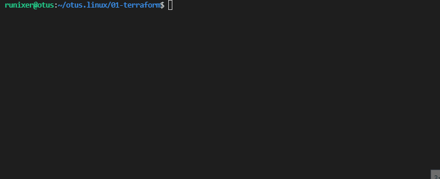

<!-- BEGIN_TF_DOCS -->
## Demo


## Requirements

* id_ed25519 ssh key loaded into ssh agent and public key in ~/.ssh/id_ed25519.pub:
```sh
ssh-keygen -t ed25519
eval `ssh-agent`
ssh-add ~/.ssh/id_ed25519
```
* ansible
```sh
pip3 install ansible
```

## Providers

The following providers are used by this module:

- <a name="provider_yandex"></a> [yandex](#provider\_yandex) (0.61.0)

## Resources

The following resources are used by this module:

- [yandex_compute_instance.nginx](https://registry.terraform.io/providers/yandex-cloud/yandex/latest/docs/resources/compute_instance) (resource)
- [yandex_vpc_network.network-1](https://registry.terraform.io/providers/yandex-cloud/yandex/latest/docs/resources/vpc_network) (resource)
- [yandex_vpc_subnet.subnet-1](https://registry.terraform.io/providers/yandex-cloud/yandex/latest/docs/resources/vpc_subnet) (resource)

## Required Inputs

The following input variables are required:

### <a name="input_cloud_id"></a> [cloud\_id](#input\_cloud\_id)

Description: The ID of the yandex cloud

Type: `string`

### <a name="input_folder_id"></a> [folder\_id](#input\_folder\_id)

Description: The ID of the folder in the yandex cloud to operate under

Type: `string`

### <a name="input_yc_token"></a> [yc\_token](#input\_yc\_token)

Description: Security token or IAM token used for authentication in Yandex.Cloud

Type: `string`

## Optional Inputs

The following input variables are optional (have default values):

### <a name="input_image_id"></a> [image\_id](#input\_image\_id)

Description: The ID of the existing disk, default is Ubuntu 20.04

Type: `string`

Default: `"fd8vmcue7aajpmeo39kk"`

### <a name="input_username"></a> [username](#input\_username)

Description: Username to use for ssh

Type: `string`

Default: `"ubuntu"`

### <a name="input_zone"></a> [zone](#input\_zone)

Description: Yandex.Cloud availability zone

Type: `string`

Default: `"ru-central1-a"`

## Outputs

The following outputs are exported:

### <a name="output_external_url_address_nginx"></a> [external\_url\_address\_nginx](#output\_external\_url\_address\_nginx)

Description: External URL of ready nginx instance
<!-- END_TF_DOCS -->