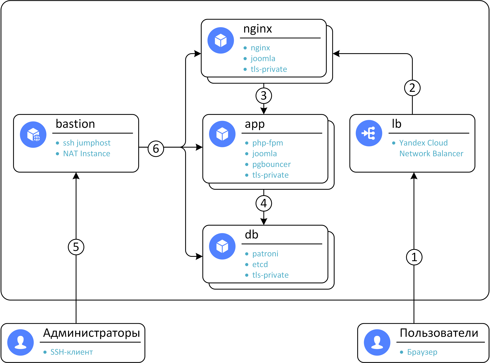

# Домашнее задание №5. Реализация кластера postgreSQL с помощью patroni
> развернуть InnoDB или PXC кластер
>
> Цель:
>
> Перевести БД веб проекта на кластер postgreSQL  с ипользованием patroni, etcd/consul/zookeeper и  haproxy/pgbouncer 
---
## Содержание
  - [1. Общая информация](#1-общая-информация)
  - [2. Роли ansible](#2-роли-ansible)
    - [2.1. etcd](#21-etcd)
    - [2.2. patroni](#22-patroni)
    - [2.3. pgbouncer](#23-pgbouncer)
  - [3. Проверка работоспособности:](#3-проверка-работоспособности)
  - [4. Общее описание модуля terraform](#4-общее-описание-модуля-terraform)
    - [4.1. Требования](#41-требования)
    - [4.2. Обязательные переменные](#42-обязательные-переменные)
      - [cloud_id](#cloud_id)
      - [folder_id](#folder_id)
      - [ssh_pubkey](#ssh_pubkey)
    - [4.3. Опциональные переменные](#43-опциональные-переменные)
      - [app_count](#app_count)
      - [image_id](#image_id)
      - [nginx_count](#nginx_count)
      - [username](#username)
      - [yc_service_account_key_file](#yc_service_account_key_file)
      - [yc_token](#yc_token)
      - [zone](#zone)
    - [4.4. Вывод работы terraform](#44-вывод-работы-terraform)
      - [external_ip_address_bastion](#external_ip_address_bastion)
      - [external_ip_address_lb](#external_ip_address_lb)
---
## 1. Общая информация
Были выбраны patroni, etcd и pgbouncer.
PostgreSQL был выбран 13 версии из-за ограничений patroni

Изначально, в предыдущих домашних заданиях, в качестве веб проекта использовался wordpress. Но в связи с тем что wordpress не поддерживает postgresql в качестве БД, приложение было изменено на Joomla. В остальном, набор ПО остался тем же - nginx/openresty, php-fpm, terraform, ansible, CentOS 8.
В написании всех ролей сильно помог данный репозиторий: https://github.com/vitabaks/postgresql_cluster

Общая схема:

1. Подключение пользователей через браузер по протоколам https/http
2. Балансировка нагрузки между nginx серверами. Статический контент отдаётся сразу с nginx-серверов. Протоколы - https/http
3. Балансировка нагрузки между php-fpm серверами приложений. Протокол - fastcgi (tcp/9000)
4. Определение текущего основного сервера БД по протоколу etcdv3-tls (tcp/2379).
Запросы в основной сервер БД по протоколу postgresql (tcp/5432)
5. Подключение администраторов к ssh-jumhost по протоколу ssh (tcp/22) с включенным ssh agent forwarding.
6. Подключение администраторов ко всем серверам с сервера bastion по протоколу ssh (tcp/22). Так же bastion выполняет роль сервера NAT для подключений в Интернет инициированных с серверов - обновления, установка ПО.
---
## 2. Роли ansible
### 2.1. etcd
Роль etcd устанавливает и настраивает etcd кластер, для последующего использования в patroni.
Роль была скомпомонована из https://github.com/andrewrothstein/ansible-etcd и https://github.com/andrewrothstein/ansible-etcd-cluster. Обе роли были объединены в одну, и немного упрощены.
В данной домашней работе роль etcd применяется ко всем серверам БД.
Etcd конфигурируется с использованием TLS (требуется так же роль tls-private для генерации соответствующих ключей и сертификатов)

Посмотреть статус кластера etcd:
```sh
[root@db-0 ~]# etcdctl endpoint status --write-out=table
+-------------------+------------------+---------+---------+-----------+------------+-----------+------------+--------------------+--------+
|     ENDPOINT      |        ID        | VERSION | DB SIZE | IS LEADER | IS LEARNER | RAFT TERM | RAFT INDEX | RAFT APPLIED INDEX | ERRORS |
+-------------------+------------------+---------+---------+-----------+------------+-----------+------------+--------------------+--------+
| https://db-0:2379 | 50e2a96a7693a47c |   3.5.0 |   37 kB |     false |      false |         2 |         41 |                 41 |        |
| https://db-1:2379 | dea2a94bc0cf9f09 |   3.5.0 |   41 kB |     false |      false |         2 |         41 |                 41 |        |
| https://db-2:2379 | 78afcb7a446d054c |   3.5.0 |   37 kB |      true |      false |         2 |         41 |                 41 |        |
+-------------------+------------------+---------+---------+-----------+------------+-----------+------------+--------------------+--------+
```
---
### 2.2. patroni
Данная роль была создана на основе https://github.com/kostiantyn-nemchenko/ansible-role-patroni.
В данной роли выполняется:
1. Установка PostgreSQL 13 из официальных репозиториев PostgreSQL
2. Установка Patroni из официальных репозиториев PostgreSQL
3. Генерация конфигурационного файла Patroni из шаблона
4. Запуск кластера БД PostgreSQL при помощи Patroni

Проверяем статус серверов БД после применения роли patroni:
```sh
[root@db-0 ~]# patronictl -c /etc/patroni/patroni.yml topology
+ Cluster: main (7014770120545757702) -------+----+-----------+
| Member | Host          | Role    | State   | TL | Lag in MB |
+--------+---------------+---------+---------+----+-----------+
| db-2   | 192.168.11.23 | Leader  | running |  1 |           |
| + db-0 | 192.168.11.20 | Replica | running |  1 |         0 |
| + db-1 | 192.168.11.17 | Replica | running |  1 |         0 |
+--------+---------------+---------+---------+----+-----------+
```
---
### 2.3. pgbouncer
pgbouncer устанавливается на сервера приложений.

Конфигурационный файл для pgbouncer генерируется при помощи confd на основании информации из etcd-кластера развернутого на серверах БД.

Аутентификация в etcd выполняется на основании tls-сертификатов.

Т.к. unix-сокеты не поддерживаются joomla, pgbouncer настроен на подключение клиентов через tcp://127.0.0.1:5432

В данной роли выполняется:
1. Установка pgbouncer из официального репозитория PostgreSQL
2. Установка службы confd, её настройка на генерацию конфигурационных файлов для pgbouncer из шаблона [pgbouncer.tmpl](ansible/roles/pgbouncer/files/pgbouncer.tmpl).
---
## 3. Проверка работоспособности:

После запуска данного terraform-модуля:
```sh
$ terraform apply
local_file.ansible_inventory: Creation complete after 6m43s [id=b0600ec8cdcfd52e13ab1c3a0fe4a3a8389ef4dc]
Apply complete! Resources: 15 added, 0 changed, 0 destroyed.
$ yc compute instance list
+----------------------+---------+---------------+---------+---------------+----------------+
|          ID          |  NAME   |    ZONE ID    | STATUS  |  EXTERNAL IP  |  INTERNAL IP   |
+----------------------+---------+---------------+---------+---------------+----------------+
| fhm3lscjq9jgfjflsrm8 | app-0   | ru-central1-a | RUNNING |               | 192.168.11.18  |
| fhm4av3ugpj8b1ipbhpl | nginx-0 | ru-central1-a | RUNNING |               | 192.168.11.23  |
| fhm6973vefic41iq8hdl | app-1   | ru-central1-a | RUNNING |               | 192.168.11.10  |
| fhmcgv2tqt81b8tn45hs | nginx-1 | ru-central1-a | RUNNING |               | 192.168.11.25  |
| fhmo20opg1sdepbn1aq4 | bastion | ru-central1-a | RUNNING | 62.84.113.195 | 192.168.11.254 |
| fhmp1fnnqg7jujlrm2to | db-0    | ru-central1-a | RUNNING |               | 192.168.11.26  |
| fhmr4d8les6h2lssmkgn | db-2    | ru-central1-a | RUNNING |               | 192.168.11.36  |
| fhmrt8v2jvrkdob05sh8 | db-1    | ru-central1-a | RUNNING |               | 192.168.11.11  |
+----------------------+---------+---------------+---------+---------------+----------------+
```

Joomla отдаёт 500 ошибку, из-за отсутствия данных в БД.
Проверим работоспособность цепочки pgbouncer/confd/etcd/patroni/postgresql восстановив данные в БД из резервной копии:
```sh
$ cd ansible
$ ansible-playbook playbook-restore.yaml
```
Плейбук завершается без ошибок, после чего Joomla начинает работать.

Проверим работоспособность pgbouncer с каждого сервера приложений:
```sh
[root@app-0 ~]$ psql -h localhost -p 5432 -d joomla_db -c 'select count(*) from information_schema.tables;'
 count 
-------
   263
(1 row)

[root@app-1 ~]$ psql -h localhost -p 5432 -d joomla_db -c 'select count(*) from information_schema.tables;'
 count 
-------
   263
(1 row)
```

Конфигурационный файл pgbouncer, сгенерированный confd:
```ini
[databases]
* = host=192.168.11.36 port=5432 pool_size=10 user=postgres password=zalando 

[pgbouncer]
pidfile = /var/run/pgbouncer/pgbouncer.pid
# Joomla doesn't work with socket
unix_socket_dir = 
#unix_socket_dir = /var/run/pgbouncer
listen_addr = 127.0.0.1
# Joomla doesn't work with any other than 5432 ports
listen_port = 5432
auth_type = any
pool_mode = session
max_client_conn = 100
default_pool_size = 20
```

192.168.11.36 это db-2. Проверим в patroni БД что именно этот сервер является Leader:
```sh
[root@db-0 ~]# patronictl topology
+ Cluster: main (7015309708472000735) -------+----+-----------+
| Member | Host          | Role    | State   | TL | Lag in MB |
+--------+---------------+---------+---------+----+-----------+
| db-2   | 192.168.11.36 | Leader  | running |  1 |           |
| + db-0 | 192.168.11.26 | Replica | running |  1 |         0 |
| + db-1 | 192.168.11.11 | Replica | running |  1 |         0 |
+--------+---------------+---------+---------+----+-----------+
```

Проверим статус etcd:
```sh
[root@db-0 ~]# etcdctl endpoint status --write-out=table
+-------------------+------------------+---------+---------+-----------+------------+-----------+------------+--------------------+--------+
|     ENDPOINT      |        ID        | VERSION | DB SIZE | IS LEADER | IS LEARNER | RAFT TERM | RAFT INDEX | RAFT APPLIED INDEX | ERRORS |
+-------------------+------------------+---------+---------+-----------+------------+-----------+------------+--------------------+--------+
| https://db-0:2379 | 6bce6fc560aeb3f5 |   3.5.0 |   66 kB |      true |      false |         3 |        154 |                154 |        |
| https://db-1:2379 | 7ffdbb2577213e20 |   3.5.0 |   66 kB |     false |      false |         3 |        154 |                154 |        |
| https://db-2:2379 | bf7f4effdfa02e68 |   3.5.0 |   66 kB |     false |      false |         3 |        154 |                154 |        |
+-------------------+------------------+---------+---------+-----------+------------+-----------+------------+--------------------+--------+
```

Сымитируем неожиданное отключение Leader:
```sh
$ yc compute instance stop db-2
done (6s)
$ yc compute instance list
+----------------------+---------+---------------+---------+---------------+----------------+
|          ID          |  NAME   |    ZONE ID    | STATUS  |  EXTERNAL IP  |  INTERNAL IP   |
+----------------------+---------+---------------+---------+---------------+----------------+
| fhm3lscjq9jgfjflsrm8 | app-0   | ru-central1-a | RUNNING |               | 192.168.11.18  |
| fhm4av3ugpj8b1ipbhpl | nginx-0 | ru-central1-a | RUNNING |               | 192.168.11.23  |
| fhm6973vefic41iq8hdl | app-1   | ru-central1-a | RUNNING |               | 192.168.11.10  |
| fhmcgv2tqt81b8tn45hs | nginx-1 | ru-central1-a | RUNNING |               | 192.168.11.25  |
| fhmo20opg1sdepbn1aq4 | bastion | ru-central1-a | RUNNING | 62.84.113.195 | 192.168.11.254 |
| fhmp1fnnqg7jujlrm2to | db-0    | ru-central1-a | RUNNING |               | 192.168.11.26  |
| fhmr4d8les6h2lssmkgn | db-2    | ru-central1-a | STOPPED |               | 192.168.11.36  |
| fhmrt8v2jvrkdob05sh8 | db-1    | ru-central1-a | RUNNING |               | 192.168.11.11  |
+----------------------+---------+---------------+---------+---------------+----------------+
```

Проверим статус patroni:
```sh
[root@db-0 ~]# patronictl topology
+ Cluster: main (7015309708472000735) -------+----+-----------+
| Member | Host          | Role    | State   | TL | Lag in MB |
+--------+---------------+---------+---------+----+-----------+
| db-1   | 192.168.11.11 | Leader  | running |  2 |           |
| + db-0 | 192.168.11.26 | Replica | running |  2 |         0 |
+--------+---------------+---------+---------+----+-----------+
```

Проверим статус etcd:
```sh
[root@db-0 ~]# etcdctl endpoint status --write-out=table
{"level":"warn","ts":"2021-10-05T00:04:59.730+0300","logger":"etcd-client","caller":"v3/retry_interceptor.go:62","msg":"retrying of unary invoker failed","target":"etcd-endpoints://0xc0003048c0/#initially=[https://db-0:2379;https://db-1:2379;https://db-2:2379]","attempt":0,"error":"rpc error: code = DeadlineExceeded desc = context deadline exceeded"}
Failed to get the status of endpoint https://db-2:2379 (context deadline exceeded)
+-------------------+------------------+---------+---------+-----------+------------+-----------+------------+--------------------+--------+
|     ENDPOINT      |        ID        | VERSION | DB SIZE | IS LEADER | IS LEARNER | RAFT TERM | RAFT INDEX | RAFT APPLIED INDEX | ERRORS |
+-------------------+------------------+---------+---------+-----------+------------+-----------+------------+--------------------+--------+
| https://db-0:2379 | 6bce6fc560aeb3f5 |   3.5.0 |   78 kB |      true |      false |         3 |        172 |                172 |        |
| https://db-1:2379 | 7ffdbb2577213e20 |   3.5.0 |   70 kB |     false |      false |         3 |        172 |                172 |        |
+-------------------+------------------+---------+---------+-----------+------------+-----------+------------+--------------------+--------+
```

Проверим конфигурационный файл pgbouncer:
```ini
[databases]
* = host=192.168.11.11 port=5432 pool_size=10 user=postgres password=zalando 

[pgbouncer]
pidfile = /var/run/pgbouncer/pgbouncer.pid
# Joomla doesn't work with socket
unix_socket_dir = 
#unix_socket_dir = /var/run/pgbouncer
listen_addr = 127.0.0.1
# Joomla doesn't work with any other than 5432 ports
listen_port = 5432
auth_type = any
pool_mode = session
max_client_conn = 100
default_pool_size = 20
```

192.168.11.11 это db-1, соответственно автоматическое изменение конфигурационного файла произошло автоматически.

Joomla продолжает функционировать.

## 4. Общее описание модуля terraform

Этот модуль terraform создаёт:
* 1 хост bastion (используется как ssh-джампхост и NAT для соединений от остальных серверов в Интернет)
* Указанное в переменной db_count количество серверов с ролями etcd, patroni
* Указанное в переменной app_count количество серверов с ролями php_fpm, joomla, pgbouncer
* Указанное в переменной nginx_count количество серверов с ролями nginx, joomla
* 1 балансировщик нагрузки, распределяющий обращения между серверами с nginx

Особенности:
* Реализован TLS для серверов с nginx, в качестве корневого сертификата для целей демонстрации используются самоподписанный, из директории cfssl
* Для всех серверов кроме bastion используется ОС CentOS 8 Stream
* Устанавливаются все доступные обновления для всех серверов
* Реализовано создание резервной копии БД (плейбук playbook-backup.yaml), и восстановление из него (плейбук playbook-restore.yaml). Дамп БД с уже сконфигурированным приложением для демонстрации есть в репозитории - dump.sql

Примечания:
* Предполагается использование ssh agent forwading при подключении к bastion.
* Само приложение доступно по https://otus.internal (terraform добавляет соответствующую запись в /etc/hosts)

### 4.1. Требования

Несколько не входящих в стандартную поставку коллекций ansible:
```sh
ansible-galaxy collection install ansible.posix
ansible-galaxy collection install community.general
ansible-galaxy collection install community.crypto
ansible-galaxy collection install community.postgresql
```

### 4.2. Обязательные переменные

Следующие переменные обязательно должны быть определены для terraform:

#### cloud_id

Описание: The ID of the yandex cloud

Тип: `string`

#### folder_id

Описание: The ID of the folder in the yandex cloud to operate under

Тип: `string`

#### ssh_pubkey

Описание: SSH public key

Тип: `string`


### 4.3. Опциональные переменные

Следующие переменные terraform опциональны (есть значения по умолчанию):

#### app_count

Описание: Count of app node instances

Тип: `number`

Значение по умолчанию: `2`

#### image_id

Описание: The ID of the existing disk, default is CentOS 8 Stream

Тип: `string`

Значение по умолчанию: `"fd8hnbln4tn9k0823esa"`

#### nginx_count

Описание: Count of nginx node instances

Тип: `number`

Значение по умолчанию: `2`

#### username

Описание: Username to use for ssh

Тип: `string`

Значение по умолчанию: `"otus"`

#### yc_service_account_key_file

Описание: (Optional) Contains either a path to or the contents of the Service Account file in JSON format

Тип: `string`

Значение по умолчанию: `null`

#### yc_token

Описание: (Optional) Security token or IAM token used for authentication in Yandex.Cloud

Тип: `string`

Значение по умолчанию: `null`

#### zone

Описание: Yandex.Cloud availability zone

Тип: `string`

Значение по умолчанию: `"ru-central1-a"`

### 4.4. Вывод

В результате работы модуля terraform, выводятся следующие переменные:

#### external_ip_address_bastion

Описание: Внешний IP-адрес сервера bastioninstance

#### external_ip_address_lb

Описание: Внешний IP-адрес балансировщика
