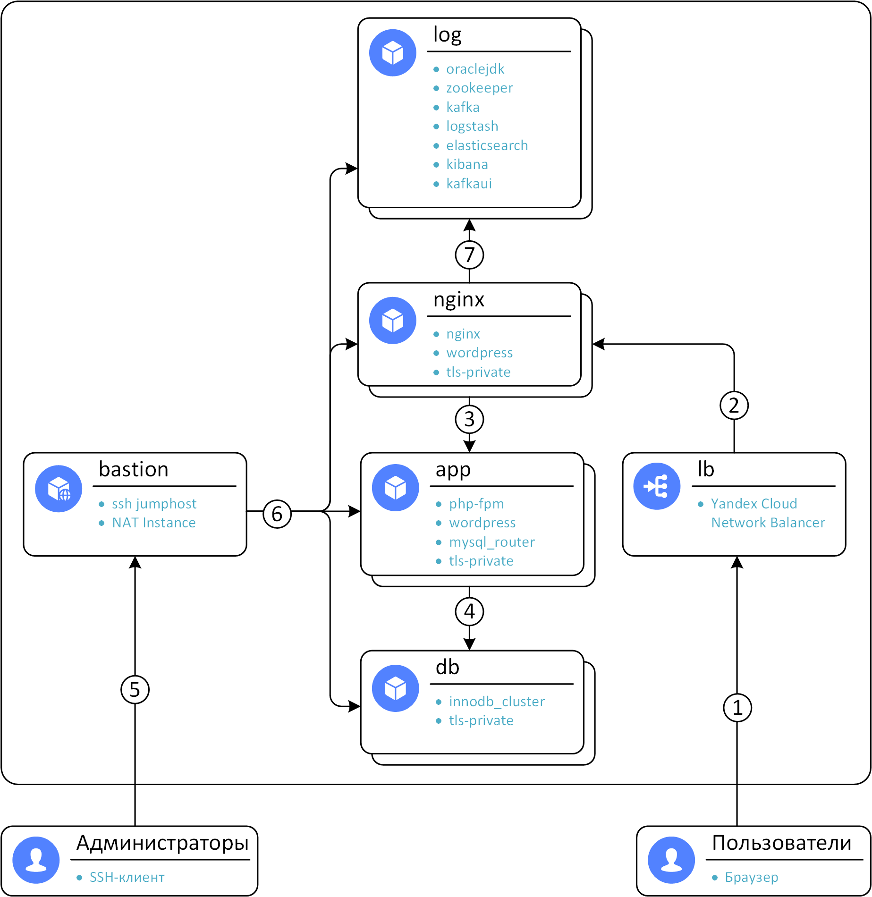
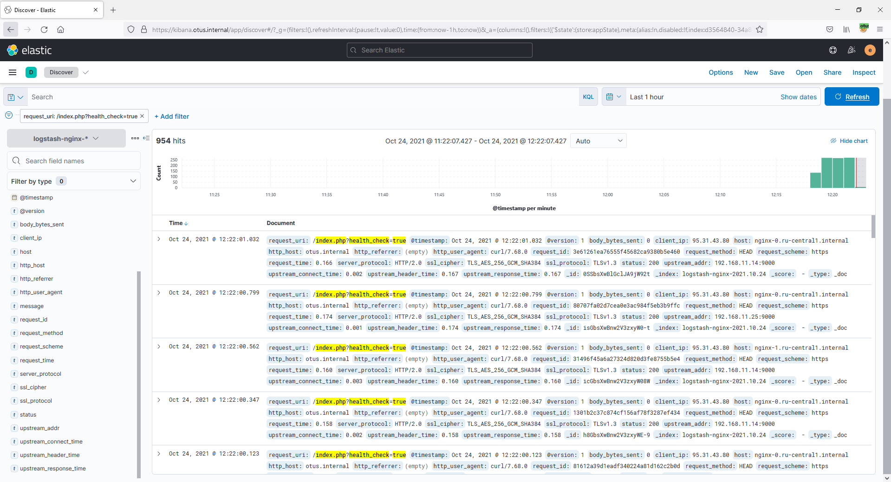
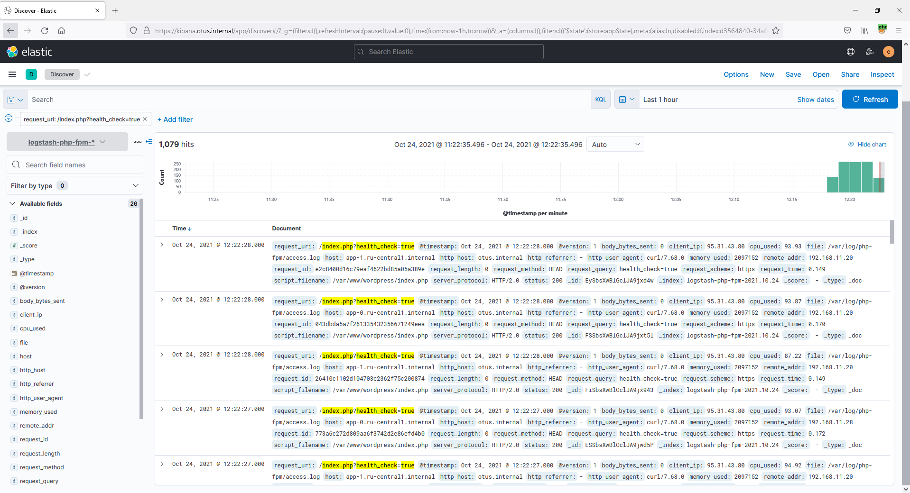
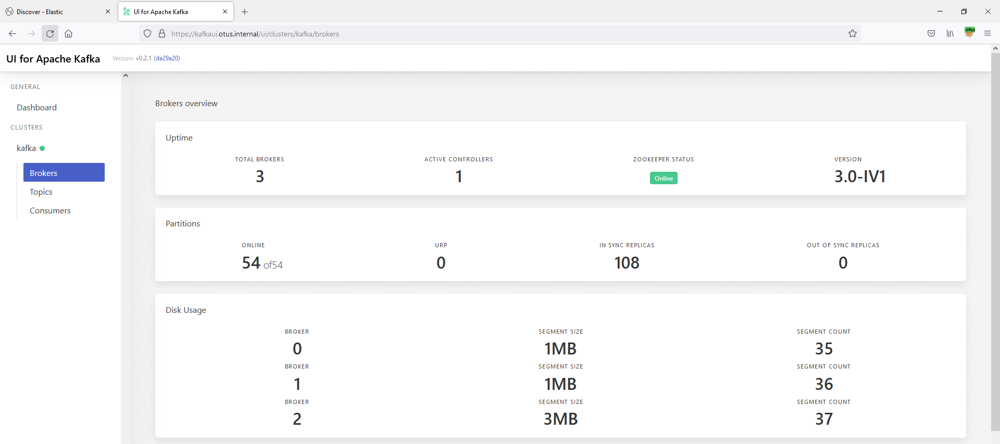
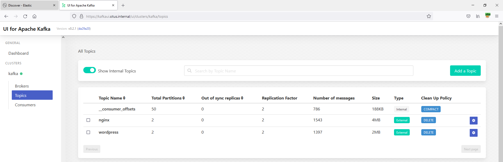
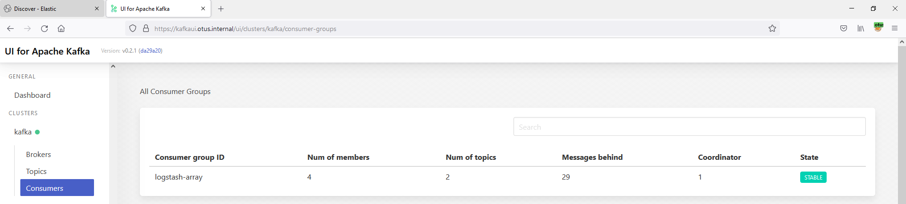
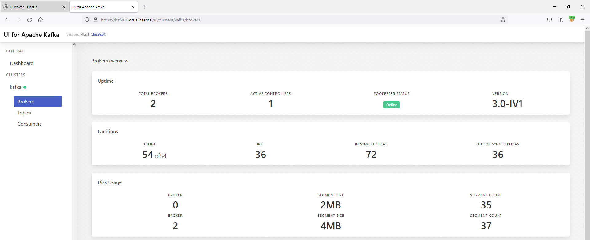
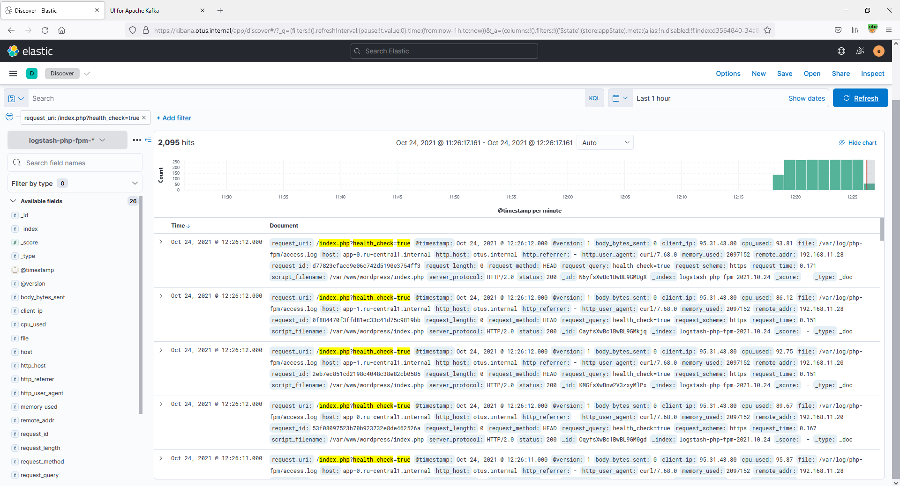
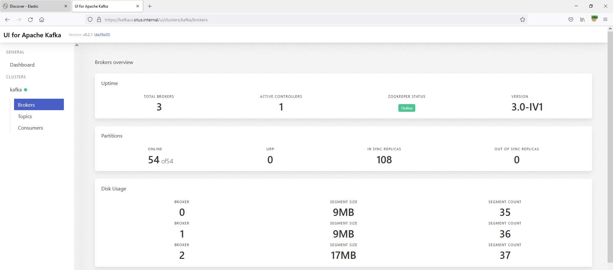
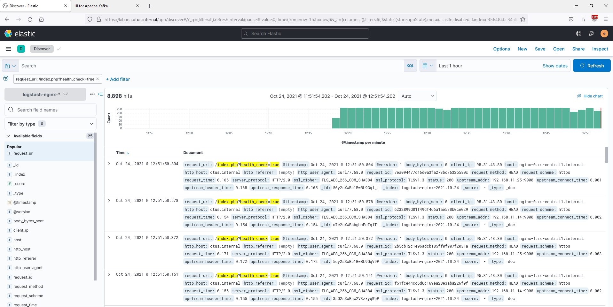

# Домашнее задание №6. Реализация очереди для сборщика логов между logstash и elasticsearch
> Реализация очереди для сборщика логов между logstash и elasticsearch
>
> Цель:
>
> * настроить сбор логов с веб портала реализованного ранее
> * настроить kafka как промежуточную очередь между logstash  и elasticsearch
> * развернуть  кафку на 1 ноде
> * создать 2 топика  по 2 шарда и 2 реплики (nginx  и wordpress)
> * на каждой ноде поставить на выбор filebeat/fluentd/vector
> * собирать этим утилитами логи nginx и wordpress
> * отправлять в 2 разных топика nginx и wordpress
> * развернуть ELK на одной ноде
> * настроить логстэш для забора данных с кафки и сохранение в 2 индекса
> * настроить индекс паттерны в кибане 
> * и кафку и ELK развернуть в кластере

---
## Содержание
  - [1. Общая информация](#1-общая-информация)
  - [2. Роли ansible](#2-роли-ansible)
    - [2.1. oraclejdk](#21-oraclejdk)
    - [2.2. zookeeper](#22-zookeeper)
    - [2.3. kafka](#23-kafka)
    - [2.4. logstash](#24-logstash)
    - [2.5. elasticsearch](#25-elasticsearch)
    - [2.6. kibana](#26-kibana)
    - [2.7. kafkaui](#27-kafkaui)
    - [2.8. vector](#28-vector)
  - [3. Проверка работоспособности](#3-проверка-работоспособности)
  - [4. Общее описание модуля terraform](#4-общее-описание-модуля-terraform)
    - [4.1. Требования](#41-требования)
    - [4.2. Обязательные переменные](#42-обязательные-переменные)
      - [cloud_id](#cloud_id)
      - [folder_id](#folder_id)
      - [ssh_pubkey](#ssh_pubkey)
    - [4.3. Опциональные переменные](#43-опциональные-переменные)
      - [app_count](#app_count)
      - [image_id](#image_id)
      - [nginx_count](#nginx_count)
      - [username](#username)
      - [yc_service_account_key_file](#yc_service_account_key_file)
      - [yc_token](#yc_token)
      - [zone](#zone)
    - [4.4. Вывод](#44-вывод)
      - [external_ip_address_bastion](#external_ip_address_bastion)
      - [external_ip_address_lb](#external_ip_address_lb)
---
## 1. Общая информация

Для сбора журналов был выбран vector.

Ansible-роль nginx была модифицирована:
1. Сконфигурирован вывод access и error журналов в journald через syslog в формате json.
2. Добавлены TLS-сертификаты и конфигурации для Kibana и Kafka UI.

Так же в ansible-роли php-fpm был сконфигурован вывод access-журналов в формате json. К сожалению, php-fpm до сих пор не поддерживает отправку журналов в syslog либо в journald. В связи с этим добавил конфигурирование logrotate для файлов журналов php-fpm.

Ansible-роль vector собирает access и error журналы nginx из journald, access и error журналы php-fpm из файлов. Далее vector отправляет журналы в kafka.

Для разворачивания kafka/logstash/elasticsearch/kibana/kafkaui была создана новая роль серверов - log. Количество экземпляров log-серверов регулируется через terraform-переменную log_count. Была проверена работоспособность при log_count=1 и log_count=3.

Общая схема:

1. Подключение пользователей через браузер по протоколам https/http
2. Балансировка нагрузки между nginx серверами. Статический контент отдаётся сразу с nginx-серверов. Протоколы - https/http
3. Балансировка нагрузки между php-fpm серверами приложений. Протокол - fastcgi (tcp/9000)
4. Запросы к серверам БД по протоколу mysql (tcp/3306)
5. Подключение администраторов к ssh-jumhost по протоколу ssh (tcp/22) с включенным ssh agent forwarding.
6. Подключение администраторов ко всем серверам с сервера bastion по протоколу ssh (tcp/22). Так же bastion выполняет роль сервера NAT для подключений в Интернет инициированных с серверов - обновления, установка ПО.
7. Балансировка между kibana и kafka ui серверами по проктоолу http (tcp/5601 - kibana, tcp/8081 - kafka ui)

---
## 2. Роли ansible
### 2.1. oraclejdk

Устанавливает Oracle JDK 17 из готового rpm-пакета с сайта download.oracle.com.

Oracle JDK 11 входящего в состав CentOS 8 оказалось недостаточно для работы Kafka UI.

---
### 2.2. zookeeper

Устанавливает zookeeper версии 3.7.0 с сата downloads.apache.org

В данной роли выполняется:
1. Создание отдельных группы и пользователя для запуска службы.
2. Создание всех необходимых директорий.
3. Скачивание и распаковка дистрибутива.
4. Создание конфигурационных файлов из шаблонов [zookeeper.cfg.j2](ansible/roles/zookeeper/templates/zookeeper.cfg.j2), [log4j.properties.j2](ansible/roles/zookeeper/templates/log4j.properties.j2).
5. Создание service файла для systemd из шаблона [zookeeper.service.j2](ansible/roles/zookeeper/templates/zookeeper.service.j2).
6. Создание myid файла.
7. Добавление директории с исполняемыми файлами в переменную PATH.
8. Включение и запуск systemd-службы.

---
### 2.3. kafka
Устанавливает kafka версии 3.0.0 с сата downloads.apache.org

В данной роли выполняется:
1. Создание отдельных группы и пользователя для запуска службы.
2. Создание всех необходимых директорий.
3. Скачивание и распаковка дистрибутива.
4. Создание конфигурационного файла из шаблона [kafka.properties.j2](ansible/roles/kafka/templates/kafka.properties.j2).
5. Создание service файла для systemd из шаблона [kafka.service.j2](ansible/roles/kafka/templates/kafka.service.j2).
6. Добавление директории с исполняемыми файлами в переменную PATH.
7. Включение и запуск systemd-службы.
8. Создание топиков nginx и wordpress. 2 шарда (partitions) и 2 реплики (replication-factor). 1 реплика в случае, если разворачивается всего 1 экземпляр kafka.

---
### 2.4. logstash
Устанавливает logstash версии 7 из репозитория artifacts.elastic.co

Настраивает logstash на забор данных из двух топиков kafka (nginx и wordpress) и отдачу в elasticsearch в два отдельных индекса (logstash-nginx и logstash-php-fpm)

В данной роли выполняется:
1. Включение репозитория artifacts.elastic.co
2. Установка logstash из репозитория.
3. Создание конфигурационных файлов из шаблонов [logstash.yml.j2](ansible/roles/logstash/templates/logstash.yml.j2), [pipelines.yml.j2](ansible/roles/logstash/templates/pipelines.yml.j2), [kafka_nginx.conf.j2](ansible/roles/logstash/templates/kafka_nginx.conf.j2), [kafka_php-fpm.conf.j2](ansible/roles/logstash/templates/kafka_php-fpm.conf.j2).
4. Включение и запуск systemd-службы.

---
### 2.5. elasticsearch
Устанавливает elasticsearch версии 7 из репозитория artifacts.elastic.co

Настраивает logstash на забор данных из двух топиков kafka (nginx и wordpress) и отдачу в elasticsearch в два отдельных индекса (logstash-nginx и logstash-php-fpm)

В данной роли выполняется:
1. Включение репозитория artifacts.elastic.co
2. Установка elasticsearch из репозитория.
3. Создание приватного ключа и tls-сертификата для elasticsearch.
4. Запись публичного сертификата CA в отдельную директорию для elasticsearch.
5. Создание конфигурационного файла из шаблона [elasticsearch.yml.j2](ansible/roles/elasticsearch/templates/elasticsearch.yml.j2).
6. Задаётся bootstrap-пароль для пользователя elastic
7. Включение и запуск systemd-службы.
8. Посредством REST API создаётся роль logstash_writer
9. Посредством REST API cоздаются пользователи logstash_internal (роль logstash_writer), logstash_admin (роли logstash_admin и logstash_writer)
10. Посредством REST API задаются пароли для пользователей kibana_system, logstash_system, logstash_admin.
11. Посредством REST API включаются пользователи kibana_system, logstash_system

---
### 2.6. kibana
Устанавливает kibana версии 7 из репозитория artifacts.elastic.co

Создаёт необходимые index patterns

В данной роли выполняется:
1. Включение репозитория artifacts.elastic.co
2. Установка kibana из репозитория.
3. Создание конфигурационного файла из шаблона [kibana.yml.j2](ansible/roles/kibana/templates/kibana.yml.j2).
4. Включение и запуск systemd-службы.
5. Посредством REST API создаются index patterns

---
### 2.7. kafkaui
Устанавливает [Kafka UI](https://github.com/provectus/kafka-ui) версии 0.2.1 из дистрибутива с github.

В данной роли выполняется:
1. Создание отдельных группы и пользователя для запуска службы.
2. Создание всех необходимых директорий.
3. Скачивание и распаковка дистрибутива.
4. Создание service файла для systemd из шаблона [kafkaui.service.j2](ansible/roles/kafkaui/templates/kafkaui.service.j2).
5. Включение и запуск systemd-службы.

---
### 2.8. vector
Устанавливает [Vector](https://vector.dev/) из репозитория repositories.timber.io

В данной роли выполняется:
1. Включение репозитория repositories.timber.io
2. Установка vector из репозитория.
3. Добавление пользователя vector в группу adm для доступа к файлам журналов.
4. Создание конфигурационного файла из шаблона [vector.toml.j2](ansible/roles/vector/templates/vector.toml.j2).
5. Включение и запуск systemd-службы.

---
## 3. Проверка работоспособности

После запуска данного terraform-модуля:
```sh
$ terraform apply -auto-approve
local_file.ansible_inventory: Creation complete after 36m17s [id=d5c491342fdaa6097e2c6438545e8a91ae8ca65b]
Apply complete! Resources: 18 added, 0 changed, 0 destroyed.
$ yc compute instance list
+----------------------+---------+---------------+---------+-----------------+----------------+
|          ID          |  NAME   |    ZONE ID    | STATUS  |   EXTERNAL IP   |  INTERNAL IP   |
+----------------------+---------+---------------+---------+-----------------+----------------+
| fhm2cih9d692pjcigj01 | app-1   | ru-central1-a | RUNNING |                 | 192.168.11.29  |
| fhm6nmb5dpn8t9ba60sf | log-0   | ru-central1-a | RUNNING |                 | 192.168.11.22  |
| fhm90c4v7422r52gnh64 | log-1   | ru-central1-a | RUNNING |                 | 192.168.11.25  |
| fhmaqhtdfs5e0dij9gil | db-2    | ru-central1-a | RUNNING |                 | 192.168.11.30  |
| fhmhm17hgsnqhu42fb5u | nginx-1 | ru-central1-a | RUNNING |                 | 192.168.11.4   |
| fhmkfa7vlno2qc5mosts | log-2   | ru-central1-a | RUNNING |                 | 192.168.11.20  |
| fhmp3p0nv4p4s73o0nvp | bastion | ru-central1-a | RUNNING | 178.154.204.143 | 192.168.11.254 |
| fhmpu74q2d938c41rauc | db-1    | ru-central1-a | RUNNING |                 | 192.168.11.18  |
| fhmsug28mpf619eu3a1s | app-0   | ru-central1-a | RUNNING |                 | 192.168.11.31  |
| fhmsviveno3s1l3kafri | nginx-0 | ru-central1-a | RUNNING |                 | 192.168.11.38  |
| fhmt0mta0fj63fufbav4 | db-0    | ru-central1-a | RUNNING |                 | 192.168.11.35  |
+----------------------+---------+---------------+---------+-----------------+----------------+
```

Wordpress доступен по адресу https://otus.internal:
```sh
$ curl -I https://otus.internal/index.php?health_check=true
HTTP/2 200 
server: openresty/1.19.9.1
date: Sat, 23 Oct 2021 23:12:44 GMT
content-type: text/html; charset=UTF-8
content-length: 0
x-powered-by: PHP/8.0.12
```

Запустим опрос health check в цикле, для регулярной записи в журнал:
```sh
while true; do curl https://otus.internal/index.php?health_check=true; done;
```

В Kibana видны журналы nginx:

[](images/01_kibana_nginx.png)

В Kibana видны журналы wordpress (php-fpm):

[](images/02_kibana_php-fpm.png)

В Kafka UI видны все брокеры и топики:

[](images/03_kafkaui_brokers.png)

[](images/04_kafkaui_topics.png)

[](images/05_kafkaui_consumers.png)

Сымитируем неожиданное отключение одного из log-серверов:
```sh
$ yc compute instance stop log-1
done (10s)
$ yc compute instance list
+----------------------+---------+---------------+---------+-----------------+----------------+
|          ID          |  NAME   |    ZONE ID    | STATUS  |   EXTERNAL IP   |  INTERNAL IP   |
+----------------------+---------+---------------+---------+-----------------+----------------+
| fhm2cih9d692pjcigj01 | app-1   | ru-central1-a | RUNNING |                 | 192.168.11.29  |
| fhm6nmb5dpn8t9ba60sf | log-0   | ru-central1-a | RUNNING |                 | 192.168.11.22  |
| fhm90c4v7422r52gnh64 | log-1   | ru-central1-a | STOPPED |                 | 192.168.11.25  |
| fhmaqhtdfs5e0dij9gil | db-2    | ru-central1-a | RUNNING |                 | 192.168.11.30  |
| fhmhm17hgsnqhu42fb5u | nginx-1 | ru-central1-a | RUNNING |                 | 192.168.11.4   |
| fhmkfa7vlno2qc5mosts | log-2   | ru-central1-a | RUNNING |                 | 192.168.11.20  |
| fhmp3p0nv4p4s73o0nvp | bastion | ru-central1-a | RUNNING | 178.154.204.143 | 192.168.11.254 |
| fhmpu74q2d938c41rauc | db-1    | ru-central1-a | RUNNING |                 | 192.168.11.18  |
| fhmsug28mpf619eu3a1s | app-0   | ru-central1-a | RUNNING |                 | 192.168.11.31  |
| fhmsviveno3s1l3kafri | nginx-0 | ru-central1-a | RUNNING |                 | 192.168.11.38  |
| fhmt0mta0fj63fufbav4 | db-0    | ru-central1-a | RUNNING |                 | 192.168.11.35  |
+----------------------+---------+---------------+---------+-----------------+----------------+
```

Проверим статус kafka в Kafka UI:

[](images/06_kafkaui.png)

Проверим что журналы продолжаются попадать в elasticsearch и отображаться в Kibana:

[](images/07_kibana.png)

Удалим отключенную ноду:
```sh
$ yc compute instance delete log-1
done (6s)
```

Восстановим ноду при помощи terraform:
```sh
$ terraform apply -auto-approve
local_file.ansible_inventory: Creation complete after 18m41s [id=30a24ed476e74668caff7b99bd70c7bee53675a7]
Apply complete! Resources: 2 added, 0 changed, 1 destroyed.
```

Убедимся в Kafka UI что нода появилась:
[](images/08_kafkaui.png)

Убедимся что журналы продолжают отображаться в Kibana:
[](images/09_kibana.png)

## 4. Общее описание модуля terraform

Этот модуль terraform создаёт:
* 1 хост bastion (используется как ssh-джампхост и NAT для соединений от остальных серверов в Интернет)
* Указанное в переменной db_count количество серверов с ролью innodb_cluster
* Указанное в переменной app_count количество серверов с ролями php_fpm, wordpress, mysql_router и vector
* Указанное в переменной nginx_count количество серверов с ролями nginx, wordpress и vector
* Указанное в переменной log_count количество серверов с ролями oraclejdk, elasticsearch, kibana, zookeeper, kafka, logstash и kafkaui
* 1 балансировщик нагрузки, распределяющий обращения между серверами с nginx

Особенности:
* Реализован TLS для серверов с nginx, в качестве корневого сертификата для целей демонстрации используются самоподписанный, из директории cfssl
* Для всех серверов кроме bastion используется ОС CentOS 8 Stream
* Устанавливаются все доступные обновления для всех серверов
* Реализовано создание резервной копии БД (плейбук playbook-backup.yaml). Дамп БД с уже сконфигурированным wordpress для демонстрации есть в репозитории - dump.sql

Примечания:
* Предполагается использование ssh agent forwading при подключении к bastion.
* Сам wordpress доступен по https://otus.internal (terraform добавляет соответствующую запись в /etc/hosts)
* Web-интерфейс Kibana доступен по адресу https://kibana.otus.internal
* Web-интерфейс Kafka UI доступен по адресу https://kafkaui.otus.internal

### 4.1. Требования

Несколько не входящих в стандартную поставку коллекций ansible:
```sh
ansible-galaxy collection install ansible.posix
ansible-galaxy collection install community.general
ansible-galaxy collection install community.crypto
ansible-galaxy collection install community.mysql
```

### 4.2. Обязательные переменные

Следующие переменные обязательно должны быть определены для terraform:

#### cloud_id

Описание: The ID of the yandex cloud

Тип: `string`

#### folder_id

Описание: The ID of the folder in the yandex cloud to operate under

Тип: `string`

#### ssh_pubkey

Описание: SSH public key

Тип: `string`


### 4.3. Опциональные переменные

Следующие переменные terraform опциональны (есть значения по умолчанию):

#### app_count

Описание: Count of app node instances

Тип: `number`

Значение по умолчанию: `2`

#### image_id

Описание: The ID of the existing disk, default is CentOS 8 Stream

Тип: `string`

Значение по умолчанию: `"fd8hnbln4tn9k0823esa"`

#### nginx_count

Описание: Count of nginx node instances

Тип: `number`

Значение по умолчанию: `2`

#### log_count

Описание: Count of log node instances

Тип: `number`

Значение по умолчанию: `3`

#### username

Описание: Username to use for ssh

Тип: `string`

Значение по умолчанию: `"otus"`

#### yc_service_account_key_file

Описание: (Optional) Contains either a path to or the contents of the Service Account file in JSON format

Тип: `string`

Значение по умолчанию: `null`

#### yc_token

Описание: (Optional) Security token or IAM token used for authentication in Yandex.Cloud

Тип: `string`

Значение по умолчанию: `null`

#### zone

Описание: Yandex.Cloud availability zone

Тип: `string`

Значение по умолчанию: `"ru-central1-a"`

### 4.4. Вывод

В результате работы модуля terraform, выводятся следующие переменные:

#### external_ip_address_bastion

Описание: Внешний IP-адрес сервера bastion

#### external_ip_address_lb

Описание: Внешний IP-адрес балансировщика
