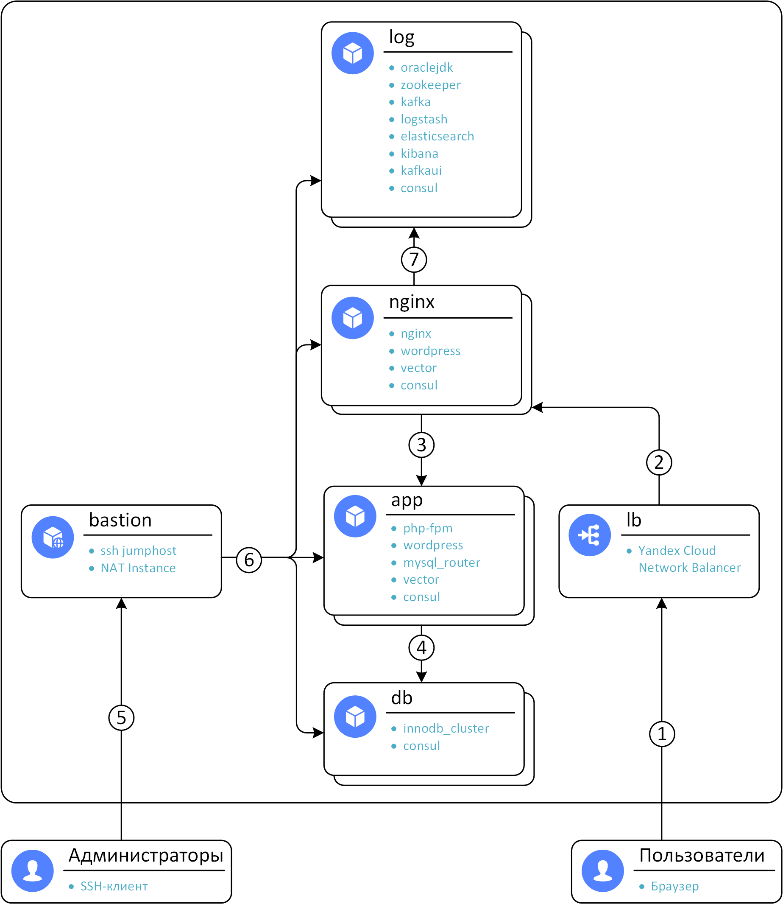
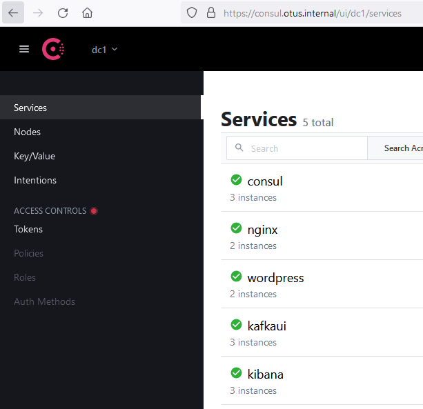
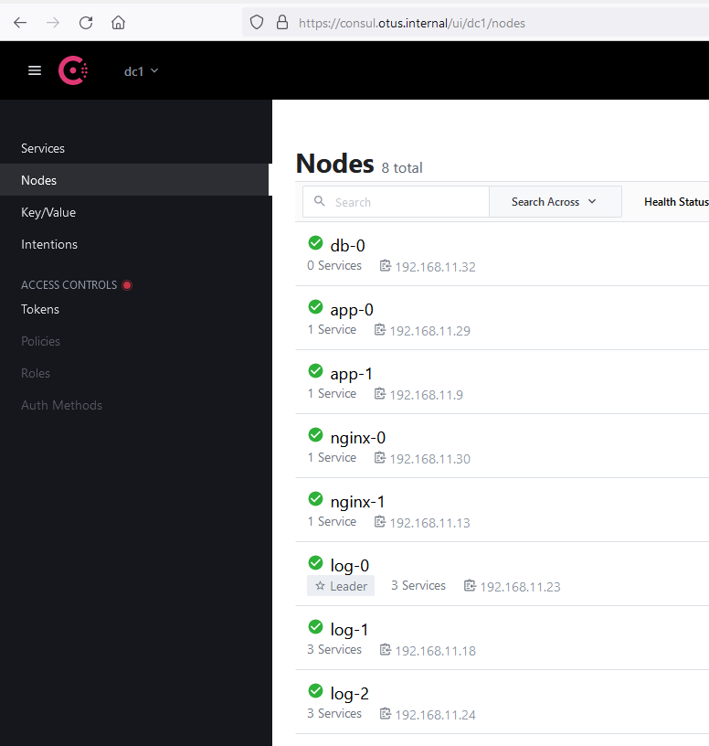
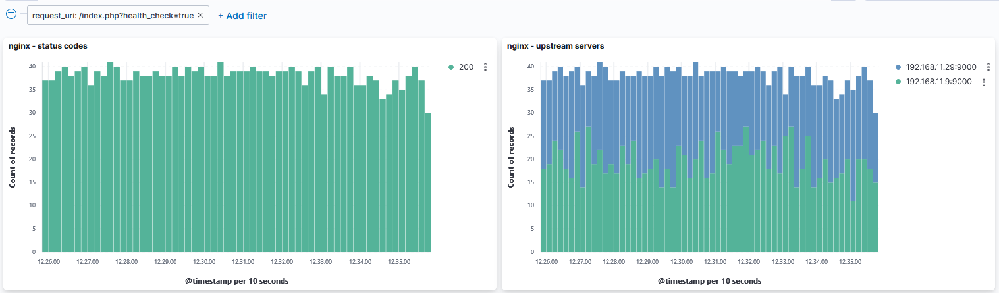
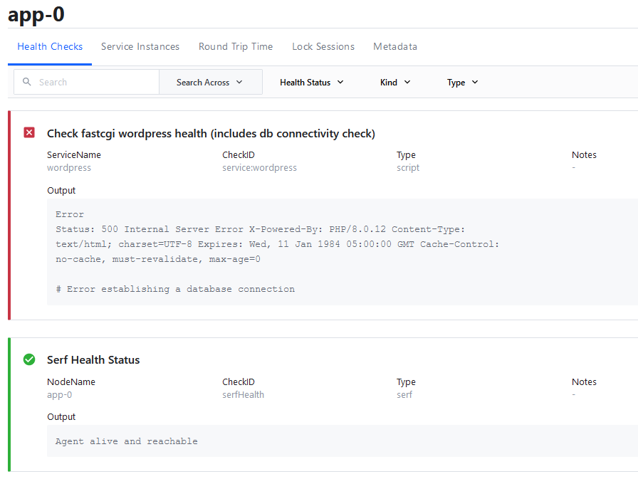
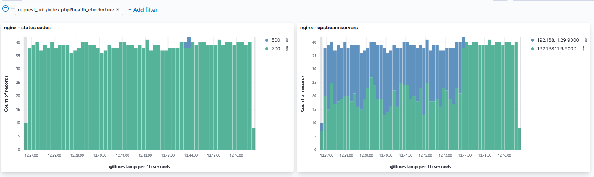
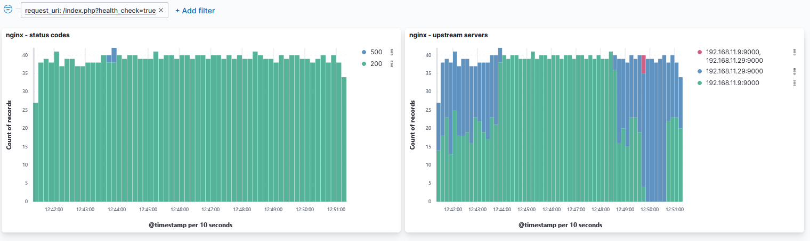
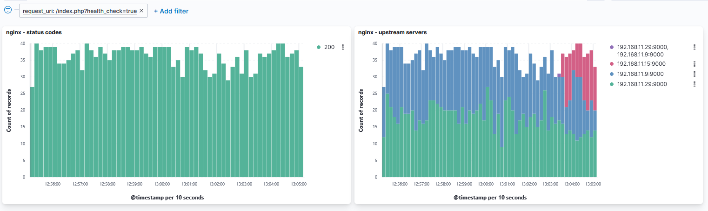

# Домашнее задание №7. Consul cluster для service discovery и DNS
> Consul cluster для service discovery и DNS
>
> Цель:
>
> * Реализовать consul cluster который выдает доменное имя для веб портала с прошлой ДЗ.
> * Плавающий IP заменить на балансировку через DNS.
> * В случае умирание одного из веб серверов IP должен убираться из DNS.

---
## Содержание
  - [1. Общая информация](#1-общая-информация)
  - [2. Роли ansible](#2-роли-ansible)
    - [2.1. oraclejdk](#21-oraclejdk)
    - [2.2. zookeeper](#22-zookeeper)
    - [2.3. kafka](#23-kafka)
    - [2.4. logstash](#24-logstash)
    - [2.5. elasticsearch](#25-elasticsearch)
    - [2.6. kibana](#26-kibana)
    - [2.7. kafkaui](#27-kafkaui)
    - [2.8. vector](#28-vector)
  - [3. Проверка работоспособности](#3-проверка-работоспособности)
  - [4. Общее описание модуля terraform](#4-общее-описание-модуля-terraform)
    - [4.1. Требования](#41-требования)
    - [4.2. Обязательные переменные](#42-обязательные-переменные)
      - [cloud_id](#cloud_id)
      - [folder_id](#folder_id)
      - [ssh_pubkey](#ssh_pubkey)
    - [4.3. Опциональные переменные](#43-опциональные-переменные)
      - [app_count](#app_count)
      - [image_id](#image_id)
      - [nginx_count](#nginx_count)
      - [username](#username)
      - [yc_service_account_key_file](#yc_service_account_key_file)
      - [yc_token](#yc_token)
      - [zone](#zone)
    - [4.4. Вывод](#44-вывод)
      - [external_ip_address_bastion](#external_ip_address_bastion)
      - [external_ip_address_lb](#external_ip_address_lb)
---
## 1. Общая информация

Была разработана роль consul, применена ко всем серверам.
Consul устанавливается из репозитория Hashicorp, версия задаётся переменной и фиксируется в пакетном менеджере.
Для log-серверов, consul конфигурируется как server, для всех остальных как client.
Созданы конфигурации сервисов consul для wordpress, nginx, kafkaui, kibana.

Ansible-роль nginx была модифицирована:
1. Вместо перечисления всех бекенд серверов в кофигурационных файлов, была настроена балансировка через DNS.
2. Добавлены конфигурационный файл и шаги создания сертификата для consului.

Общая схема:



1. Подключение пользователей через браузер по протоколам https/http
2. Балансировка нагрузки между nginx серверами. Статический контент отдаётся сразу с nginx-серверов. Протоколы - https/http
3. Балансировка нагрузки между php-fpm серверами приложений. Протокол - fastcgi (tcp/9000)
4. Запросы к серверам БД по протоколу mysql (tcp/3306)
5. Подключение администраторов к ssh-jumphost по протоколу ssh (tcp/22) с включенным ssh agent forwarding.
6. Подключение администраторов ко всем серверам с сервера bastion по протоколу ssh (tcp/22). Так же bastion выполняет роль сервера NAT для подключений в Интернет инициированных с серверов - обновления, установка ПО.
7. Балансировка между kibana и kafka ui серверами по протоколу http (tcp/5601 - kibana, tcp/8081 - kafka ui)

---
## 2. Новые роли ansible
### 2.1. consul

В данной роли выполняется:
1. Установка HashiCorp Consul из репозитория
2. Фиксация версии в пакетном менеджере
3. Генерация конфигурационного файла из шаблона [consul.hcl.j2](ansible/roles/consul/templates/consul.hcl.j2)
4. Копирование конфигурационных файлов сервисов [wordpress.hcl](ansible/roles/consul/files/wordpress.hcl), [nginx.hcl](ansible/roles/consul/files/nginx.hcl), [kibana.hcl](ansible/roles/consul/files/kibana.hcl), [kafkaui.hcl](ansible/roles/consul/files/kafkaui.hcl)
5. Копирования скрипта проверки работоспособности wordpress [check-wordpress.sh](ansible/roles/consul/files/check-wordpress.sh) и установка пакетов необходимых для его работы.
6. Включение systemd-службы consul

---
## 3. Проверка работоспособности

После запуска данного terraform-модуля:
```sh
$ terraform apply -auto-approve
local_file.ansible_inventory: Creation complete after 36m17s [id=d5c491342fdaa6097e2c6438545e8a91ae8ca65b]
Apply complete! Resources: 18 added, 0 changed, 0 destroyed.
$ yc compute instance list
+----------------------+---------+---------------+---------+---------------+----------------+
|          ID          |  NAME   |    ZONE ID    | STATUS  |  EXTERNAL IP  |  INTERNAL IP   |
+----------------------+---------+---------------+---------+---------------+----------------+
| fhm42cfkri8ebhf2gf8b | app-1   | ru-central1-a | RUNNING |               | 192.168.11.9   |
| fhmarq6l4p5d4bmb6fs6 | nginx-0 | ru-central1-a | RUNNING |               | 192.168.11.30  |
| fhmgal391n4b0drtso0t | db-0    | ru-central1-a | RUNNING |               | 192.168.11.32  |
| fhmj15jsmev1hr2uovqk | nginx-1 | ru-central1-a | RUNNING |               | 192.168.11.13  |
| fhmkv6ffk1a4gb8naea8 | log-0   | ru-central1-a | RUNNING |               | 192.168.11.23  |
| fhmlikvnt04vs76do8pl | log-1   | ru-central1-a | RUNNING |               | 192.168.11.18  |
| fhmlm9rbcictu7gk41n1 | bastion | ru-central1-a | RUNNING | 62.84.112.211 | 192.168.11.254 |
| fhmncm4306p5p0a7to6u | app-0   | ru-central1-a | RUNNING |               | 192.168.11.29  |
| fhmoqd7becrp4evpjotq | log-2   | ru-central1-a | RUNNING |               | 192.168.11.24  |
+----------------------+---------+---------------+---------+---------------+----------------+
```

Вывод consul members:
```sh
[root@log-0 ~]# consul members
Node     Address             Status  Type    Build   Protocol  DC   Segment
log-0    192.168.11.23:8301  alive   server  1.10.3  2         dc1  <all>
log-1    192.168.11.18:8301  alive   server  1.10.3  2         dc1  <all>
log-2    192.168.11.24:8301  alive   server  1.10.3  2         dc1  <all>
app-0    192.168.11.29:8301  alive   client  1.10.3  2         dc1  <default>
app-1    192.168.11.9:8301   alive   client  1.10.3  2         dc1  <default>
db-0     192.168.11.32:8301  alive   client  1.10.3  2         dc1  <default>
nginx-0  192.168.11.30:8301  alive   client  1.10.3  2         dc1  <default>
nginx-1  192.168.11.13:8301  alive   client  1.10.3  2         dc1  <default>
```

Доступен Consul UI:






Wordpress доступен по адресу https://otus.internal:
```sh
$ curl -I https://otus.internal/index.php?health_check=true
HTTP/2 200 
server: openresty/1.19.9.1
date: Mon, 01 Nov 2021 09:16:23 GMT
content-type: text/html; charset=UTF-8
content-length: 0
x-powered-by: PHP/8.0.12
x-upstream: 192.168.11.9:9000
```

Запустим опрос health check в цикле, для регулярной записи в журнал:
```sh
while true; do curl -I https://otus.internal/index.php?health_check=true 2>/dev/null | grep upstream; done;
```

В Kibana видно что нагрузка распределяется между двумя app-серверами:



DNS для сервиса wordpress:

```sh
[root@log-0 ~]# dig @localhost -p 8600 wordpress.service.dc1.lan.

; <<>> DiG 9.11.26-RedHat-9.11.26-6.el8 <<>> @localhost -p 8600 wordpress.service.dc1.lan.
; (2 servers found)
;; global options: +cmd
;; Got answer:
;; ->>HEADER<<- opcode: QUERY, status: NOERROR, id: 56789
;; flags: qr aa rd; QUERY: 1, ANSWER: 2, AUTHORITY: 0, ADDITIONAL: 1
;; WARNING: recursion requested but not available

;; OPT PSEUDOSECTION:
; EDNS: version: 0, flags:; udp: 4096
;; QUESTION SECTION:
;wordpress.service.dc1.lan.     IN      A

;; ANSWER SECTION:
wordpress.service.dc1.lan. 0    IN      A       192.168.11.29
wordpress.service.dc1.lan. 0    IN      A       192.168.11.9

;; Query time: 0 msec
;; SERVER: 127.0.0.1#8600(127.0.0.1)
;; WHEN: Mon Nov 01 12:42:00 MSK 2021
;; MSG SIZE  rcvd: 86
```

Сымитируем проблемы со связностью между сервером приложений и базой данных - остановим службу mysqlrouter на одном из серверов приложений:
```sh
[root@app-0 ~]# systemctl stop mysqlrouter
```

Теперь DNS для сервиса wordpress возвращает:
```sh
[root@log-0 ~]# dig @localhost -p 8600 wordpress.service.dc1.lan.

; <<>> DiG 9.11.26-RedHat-9.11.26-6.el8 <<>> @localhost -p 8600 wordpress.service.dc1.lan.
; (2 servers found)
;; global options: +cmd
;; Got answer:
;; ->>HEADER<<- opcode: QUERY, status: NOERROR, id: 42792
;; flags: qr aa rd; QUERY: 1, ANSWER: 1, AUTHORITY: 0, ADDITIONAL: 1
;; WARNING: recursion requested but not available

;; OPT PSEUDOSECTION:
; EDNS: version: 0, flags:; udp: 4096
;; QUESTION SECTION:
;wordpress.service.dc1.lan.     IN      A

;; ANSWER SECTION:
wordpress.service.dc1.lan. 0    IN      A       192.168.11.9

;; Query time: 0 msec
;; SERVER: 127.0.0.1#8600(127.0.0.1)
;; WHEN: Mon Nov 01 12:44:19 MSK 2021
;; MSG SIZE  rcvd: 70
```

В Consul UI видно ошибку у сервиса:



В Kibana видно, что часть запросов вернули 500 ошибку, но затем нагрузка перераспределилась на рабочий:



Вновь запустим службу mysqlrouter:
```sh
[root@app-0 ~]# systemctl start mysqlrouter
```

Теперь отправим другой сервер в перезагрузку:
```sh
[root@app-1 ~]# reboot
Connection to app-1 closed by remote host.
Connection to app-1 closed.
```

Спустя какое то время, проверим Kibana. В этот раз без 500 ошибок:



Теперь увеличим количество app серверов через переменную app_count terraform, и применим:
```sh
runixer@otus:~/otus.linux/07-consul$ terraform apply -auto-approve
local_file.ansible_inventory: Creation complete after 8m46s [id=48438c479cc16edbc39a358baf3d6771f49262ef]
Apply complete! Resources: 2 added, 0 changed, 1 destroyed.
```

В Kibana видно что новый сервер стал использоваться:



## 4. Общее описание модуля terraform

Этот модуль terraform создаёт:
* 1 хост bastion (используется как ssh-джампхост и NAT для соединений от остальных серверов в Интернет).
* Указанное в переменной db_count количество серверов с ролями innodb_cluster, consul.
* Указанное в переменной app_count количество серверов с ролями php_fpm, wordpress, mysql_router, vector, consul.
* Указанное в переменной nginx_count количество серверов с ролями nginx, wordpress, vector, consul.
* Указанное в переменной log_count количество серверов с ролями oraclejdk, elasticsearch, kibana, zookeeper, kafka, logstash, kafkaui, consul.
* 1 балансировщик нагрузки, распределяющий обращения между серверами с nginx.

Особенности:
* Реализован TLS для серверов с nginx, в качестве корневого сертификата для целей демонстрации используются самоподписанный, из директории cfssl
* Для всех серверов кроме bastion используется ОС CentOS 8 Stream
* Устанавливаются все доступные обновления для всех серверов
* Реализовано создание резервной копии БД (плейбук playbook-backup.yaml). Дамп БД с уже сконфигурированным wordpress для демонстрации есть в репозитории - dump.sql

Примечания:
* Предполагается использование ssh agent forwading при подключении к bastion.
* Сам wordpress доступен по https://otus.internal (terraform добавляет соответствующую запись в /etc/hosts)
* Web-интерфейс Kibana доступен по адресу https://kibana.otus.internal
* Web-интерфейс Kafka UI доступен по адресу https://kafkaui.otus.internal
* Web-интерфейс Consul UI доступен по адресу https://consul.otus.internal

### 4.1. Требования

Несколько не входящих в стандартную поставку коллекций ansible:
```sh
ansible-galaxy collection install ansible.posix
ansible-galaxy collection install community.general
ansible-galaxy collection install community.crypto
ansible-galaxy collection install community.mysql
```

### 4.2. Обязательные переменные

Следующие переменные обязательно должны быть определены для terraform:

#### cloud_id

Описание: The ID of the yandex cloud

Тип: `string`

#### folder_id

Описание: The ID of the folder in the yandex cloud to operate under

Тип: `string`

#### ssh_pubkey

Описание: SSH public key

Тип: `string`


### 4.3. Опциональные переменные

Следующие переменные terraform опциональны (есть значения по умолчанию):

#### app_count

Описание: Count of app node instances

Тип: `number`

Значение по умолчанию: `2`

#### image_id

Описание: The ID of the existing disk, default is CentOS 8 Stream

Тип: `string`

Значение по умолчанию: `"fd8hnbln4tn9k0823esa"`

#### nginx_count

Описание: Count of nginx node instances

Тип: `number`

Значение по умолчанию: `2`

#### log_count

Описание: Count of log node instances

Тип: `number`

Значение по умолчанию: `3`

#### username

Описание: Username to use for ssh

Тип: `string`

Значение по умолчанию: `"otus"`

#### yc_service_account_key_file

Описание: (Optional) Contains either a path to or the contents of the Service Account file in JSON format

Тип: `string`

Значение по умолчанию: `null`

#### yc_token

Описание: (Optional) Security token or IAM token used for authentication in Yandex.Cloud

Тип: `string`

Значение по умолчанию: `null`

#### zone

Описание: Yandex.Cloud availability zone

Тип: `string`

Значение по умолчанию: `"ru-central1-a"`

### 4.4. Вывод

В результате работы модуля terraform, выводятся следующие переменные:

#### external_ip_address_bastion

Описание: Внешний IP-адрес сервера bastion

#### external_ip_address_lb

Описание: Внешний IP-адрес балансировщика
